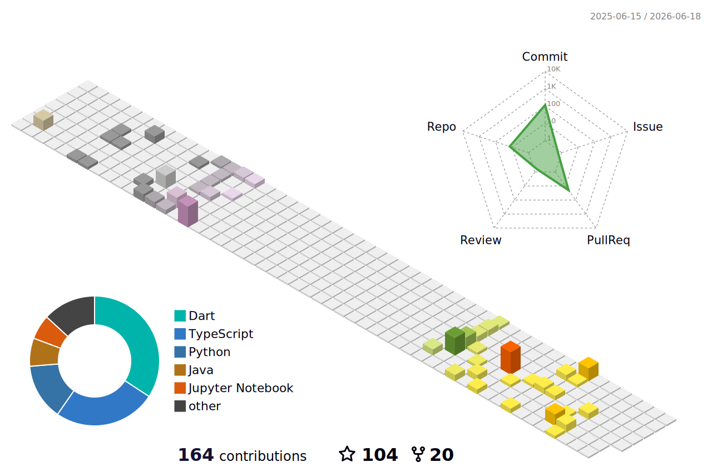

<!-- CUSTOM THEME HEADER BANNER -->

  

<!-- INFO BAR CARD ROW -->
<table width="850" border="0" cellpadding="0" cellspacing="0" align="center" style="margin-top: 15px; margin-bottom: 15px;">
  <tr>
    <td width="200" align="center"></td>
    <td width="16">&nbsp;</td>
    <td width="200" align="center"></td>
    <td width="16">&nbsp;</td>
    <td width="200" align="center"></td>
    <td width="16">&nbsp;</td>
    <td width="200" align="center"></td>
  </tr>
</table>
<!-- MAIN GRID (LEFT & RIGHT COLUMNS) -->
<table width="850" border="0" cellpadding="0" cellspacing="0" align="center">
  <tr>
    <!-- LEFT COLUMN (About, Stack, Principles, Progress) -->
    <td width="300" valign="top">
      
      <!-- Clickable Action Buttons -->
      <table width="290" border="0" cellpadding="0" cellspacing="0" style="margin-bottom: 15px;">
        <tr>
          <td width="138" align="center">
            
          </td>
          <td width="14">&nbsp;</td>
          <td width="138" align="center">
            
          </td>
        </tr>
      </table>
      
      
      
    </td>
    <!-- GRID SPACER -->
    <td width="30">&nbsp;</td>
    <!-- RIGHT COLUMN (What I Build, Featured Projects, Analytics, Upcoming) -->
    <td width="520" valign="top">
      
      <!-- Featured Projects (Fully Clickable) -->
      <h3 style="font-family: 'Outfit', sans-serif; color: #2c1e1e; font-size: 15px; font-weight: 700; margin-top: 0; margin-bottom: 10px; padding: 0;">🚀 Featured Projects</h3>
      
      <table width="510" border="0" cellpadding="0" cellspacing="0" style="margin-top: 5px; margin-bottom: 20px;">
        <tr>
          <td align="right">
            <a href="https://github.com/ayushsingh08-ds?tab=repositories" style="color: #b05a30; font-family: 'Inter', sans-serif; font-size: 11px; font-weight: 600; text-decoration: none;">
              View all repositories ➔
            </a>
          </td>
        </tr>
      </table>
      <!-- Live Styled GitHub Analytics -->
      <h3 style="font-family: 'Outfit', sans-serif; color: #2c1e1e; font-size: 15px; font-weight: 700; margin-top: 0; margin-bottom: 10px; padding: 0;">📊 GitHub Analytics</h3>
      <table width="510" border="0" cellpadding="0" cellspacing="0" style="margin-bottom: 15px;">
        <tr>
          <td width="250" valign="top">
            
          </td>
          <td width="10">&nbsp;</td>
          <td width="250" valign="top">
            
          </td>
        </tr>
        <tr>
          <td colspan="3" style="padding-top: 10px;">
            
          </td>
        </tr>
        <tr>
          <td colspan="3" style="padding-top: 10px;" align="center">
            
          </td>
        </tr>
      </table>
      
      <!-- Clickable Connect Social Icons -->
      <table width="510" border="0" cellpadding="0" cellspacing="0" style="margin-top: 10px;">
        <tr>
          <td width="110">
            
          </td>
          <td width="90">&nbsp;</td>
          <td width="110">
            
          </td>
          <td width="90">&nbsp;</td>
          <td width="110">
            
          </td>
        </tr>
      </table>
    </td>
  </tr>
</table>
<!-- FOOTER DECORATIVE BAR AND STICKY NOTE -->

  

