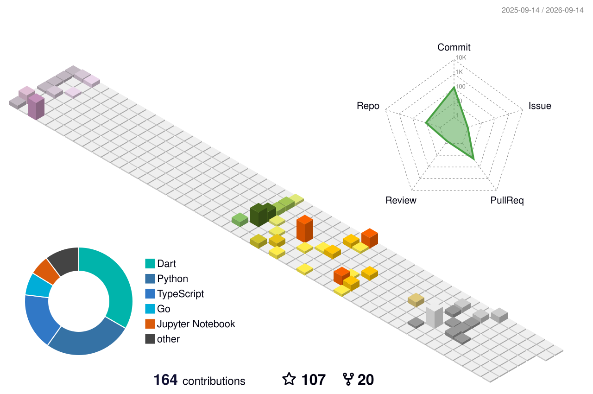

<!-- Profile banner -->

<!-- At a glance: education, location, what I'm open to, how to reach me.
     Two per row: four 200px cards need 836px and the profile column is narrower
     than that on laptops and in print, so one row of four wrapped 3 + 1. -->

 

 

<!-- About and the two actions -->

 

<!-- Stack, principles, current work, what I build -->

<h2 align="center">🚀 Featured Projects</h2>

<a href="https://github.com/ayushsingh08-ds?tab=repositories">View all repositories ➔</a>

<h2 align="center">📊 GitHub Analytics</h2>

<!-- Upcoming work, and where to find me -->

  

