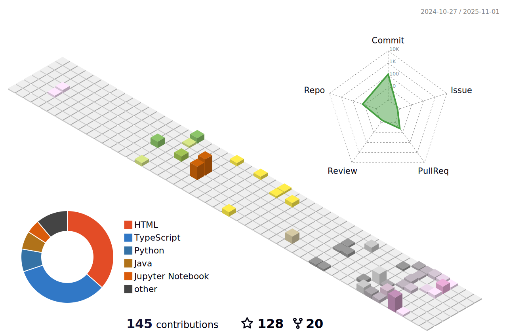

 
  
  
  

 
  
  
  <h2>🚀 Another line of code in an uncaring universe 🌌</h2>
  
  
  

---

## 📊 About Me

<table>
  <tr>
    <td>
        
    </td>
    <td>
      
- 🎓 **Student** pursuing B.Tech in **Computer Science & Data Science** at Dayananda Sagar University
- 🔍 **Passionate** about Data Science, Machine Learning, and Software Development
- 💻 **Currently Learning** Advanced Python, Deep Learning, and Web Technologies
- 📈 **Interested in** AI/ML projects, Data Visualization, and Backend Development
- 📧 **Reach me at** [ayushsingh2005811@gmail.com](mailto:ayushsingh2005811@gmail.com)
- ⚡ **Fun fact:** I am ALIVE!

    </td>
  </tr>
</table>

## 🌐 Connect With Me

  
  &nbsp;&nbsp;&nbsp;&nbsp;
  
  &nbsp;&nbsp;&nbsp;&nbsp;
  
  &nbsp;&nbsp;&nbsp;&nbsp;
  

---

## 🛠️ Tech Stack & Tools

### Programming Languages

### Web Technologies

### Data Science & AI

### Game Development

### Tools & Platforms

---

## 📈 GitHub Analytics

  
### 📊 GitHub Stats

### 🔥 GitHub Streak

### 🏆 GitHub Trophies

---

## 🎯 Current Focus

  <table>
    <tr>
      <td align="center" width="33.3%">
        
        <h3>🔬 Data Science Projects</h3>
        
Working on ML models and data analysis

      </td>
      <td align="center" width="33.3%">
        
        <h3>💻 Software Development</h3>
        
Building web applications and tools

      </td>
      <td align="center" width="33.3%">
        
        <h3>🎮 Game Development</h3>
        
Creating interactive games and experiences

      </td>
    </tr>
  </table>

---

## 🎨 Contribution Graph

  

  

---

  
  
  ### 💭 Quote of the Day
  
   – ASH
  
  **Thanks for visiting my profile! Let's connect and build something amazing together! 🚀**
  

    
    
    
    
    
    
    
    
    
    
    
    
    
    
    
    
    
    
    
    
    
    
    

  

