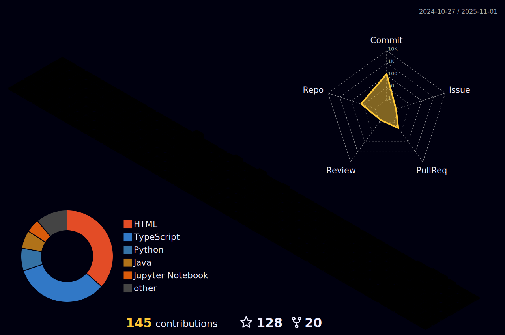

<h1 align="center">Hi 👋, I'm Ash</h1>

<h3 align="center">A passionate Student from India</h3>

- 🔭 I’m currently a student doing [B tech. in CSE Data science](in Dayananda Sagar university)

- 👯 I’m am collaborating  on **Qr Attendance** with <a href="https://github.com/alurubalakarthikeya">Karthikheya</a> and <a href="https://github.com/ArjiJethin" >Jethin</a>

- 🤝 I’m looking for help with **2D side scrolling game**

- 📫 How to reach me **ayushsingh2005811@gmail.com**

- ⚡ Fun fact **I am alive**

<h3 align="left">Connect with me:</h3>

<h3 align="left">Languages and Tools:</h3>

  
 
 
 

 

 

<h1 style="text-align:center">Git data</h1>
<h3>MAH STATS </h3>

&nbsp;

 

<h3>MAH STREAK </h3>

 

<h3>MAH Language  </h3>

 

<h3> MAH TROPHY</h3>

<h1>Contribution</h1>

